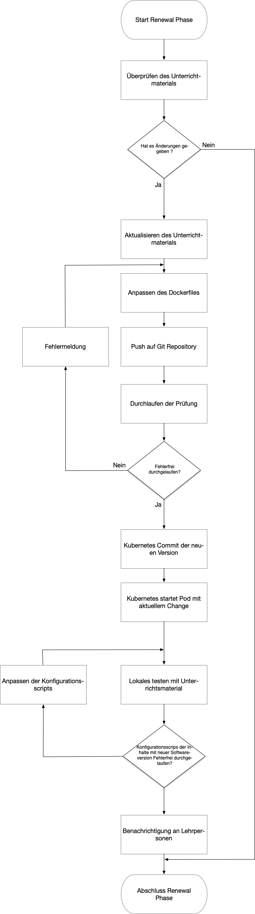
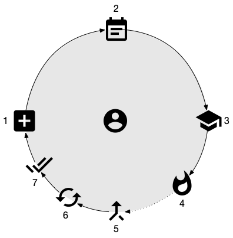
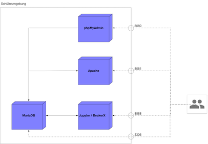
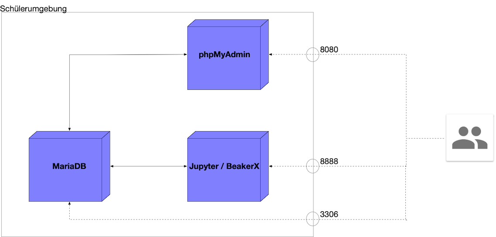

# Unterricht im Cluster

## Einleitung

In der heutigen Zeit, in der sich Technologien rasend weiterentwickeln und weiterentwickelt werden, fungiert die Berufsschule oft als erster Kontaktpunkt zwischen dem pädagogischen Unterricht und der Technologie. Diese beiden Seiten, wie auch der Lehrkörper selbst, stellen Anforderungen an die
Schule. Gerade die Arbeit in der Informatik bietet viele Stolperfallen im Sinne der Vorbereitung und der Systemkompatibilität über alle Hersteller und möglichst vielen Variationen von Systemen. Dazu
kommt, dass die Vorbereitung von Inhalten abhängig von Technologien und dessen Versionen ist, was die Herausforderung stellt ein homogenes System zu stellen, welches über alle Systeme und Versionen hinweg identisch anzuwenden ist.

Deswegen wurde im Rahmen der Vertiefungsarbeite der TBZ HF ITSE17 eine Variante umgesetzt in der sichergestellt ist das die Bereitstellung der Lernumgebung Fehlerfrei und Einheitlich erfolgt, ohne grossen Aufwand betreiben zu müssen. 

Dieses Repository ist als Erklärung und Anleitung für Lehrpersonen zu verstehen und soll ebenalls den technischen Einblick gewähren um selbst solche Module zu bauen. Dies baut im wesentlichen auf dem M300 von Marcel Bernet auf dem Github Repository https://www.github.com/mc-b/lernkube dessen Erläuterungen zu Containerisierung und Orchestrierung hier verlinkt sind.  

## Technologie

Die hierfür verwendete Technologie basiert grundlegend auf Containerisierung (https://github.com/mc-b/M300/tree/master/30-Container)  welche mit Orchestrierungssoftware (in diesem Fall Kubernetes (https://github.com/mc-b/M300/tree/master/40-Kubernetes) aufgezogen und betrieben wird. 
Der Vorteil hier liegt auf der Hand: Die Umgebung welche für die Schüler eingerichtet werden muss, Beispielsweise im einem Datenbank Modul (mit einem Webserver, einer MySQL Datenbank, und einer phpMyAdmin Oberfläche) ist an sich komplett vorgegeben. Die Vorlage hierfür liegt auf einem Repository, in diesem Fall dieser hier, und wird von der Clustern über die Oberfläche einfach angewendet, immer mit der selben Verison inkl. deren Eigenheiten. Das heisst das man den Problemen einer klassischen Schulumgebung in denen jeder Schüler selbst eine XAMPP Version installiert, je nach Zeitpunkt des Download eine Abweichende Version haben könnte.

Zusätzlich zu der Bereitstellung der Software für die praktische Arbeit, wird ebenfalls Jupyter Notebooks berietgestellt. Hierbei handelt es sich um eine Webapplikation die in den entsprechenden Modulen enhalten ist, welche die Scripts beherbergen soll. Jupyter ermöglicht Code Live auszuführen, das heisst dass ich einerseits theoretische Inputs wie in einem PDF beschreiben kann, aber ebenfalls ein Eingabefeld bereitsstellt in dem der Schüler das beschrieben direkt anwendet. 

Grundsätzlcih ist es hier auch möglich eine Datenbank im Einführungsteil also zu erstellen, tables zu erstellen und Daten einzufüllen - und zur Kontrolle mit einem phpMyAdmin oder der MySQL Workbench die Auswirkungen live mitzuverfolgen. 

# Vogelperspektive Anwendungskonzept
##  Cluster

Auf den Clustern welche der Schule zur Verfügung stehen werden die Lernumgebungen betrieben. Für den Zugang auf die Daten, wie es zB beim Modul der Webentwicklung nützlich ist, wird auf die NFS Freigabe zugegriffen um Dateien zu platzieren die dann durch den Server angezeigt werden. 
Entsprechend sind alle Lehrpersonen selbst für die bereitstellung der Module auf ihrem Cluster zuständig. Dies ist jedoch durch die Verteifungsarbeit eines anderen Schülers realisiert und vereinfacht. 

1. Modulverantwortlicher bearbeitet das Dockerfile nach Anleitung, testet lokal den Unterrichtsinhalt am neuen File
2. Upload auf Github des Dockerfiles 
3. Versionisierung auf GitHub
4. Erstellen des Images und ablegen auf eigener Registry durch den Modulverantwortlichen
5. Informieren der Lehrpersonen über neue Version
6. Kubernetes erstellt ab sofort aus den aktuellen Images die Pods nach Parameter
7. User können auf die Pods zugreifen

## Lernkube

Die Umgebung auf dem Lernkube (https://github.com/mc-b/lernkube) ist analog der des Kubernetesclusters funktional identisch. Ausnahme hier ist lediglich die Ablage der Daten welche in der Clustervariante schlussendlich auf NFS Ferigaben schrieben und im Lernkube einen Speicherort in der Vagrant Maschine finden. Diese sind abgreif- und veränderbar und unter dem Pfad "/data" auffindbar. 

Im Gegensatz zum Cluster in dem die Volumes bzw Shares im selben File (https://github.com/zoink1989/vertiefungsarbeit/blob/master/web.yml) beschrieben ist, ist dies in der lokalen Variante verschieden. 

Hier sind die Persistant Volumes in einer eigenen YAML-Datei (https://github.com/zoink1989/vertiefungsarbeit/blob/master/localVolumes.yml) hinterlegt und die Anleitung für die weiteren Deployments in der entsprechenden Datei web.yml (https://github.com/zoink1989/vertiefungsarbeit/blob/master/web.yml).

## Wartung Schülerinstanzen

Grundsätzlich brauchen die Systeme welche im Kubernetescluster aufgezogen werden keine Wartung, da diese am Ende der Module einfach gelöscht und auf Knopfdruck wieder neu gebaut werden. 

## Weiterentwicklung und Lifecycle

Einzig die Versionen der Software kann angepasst werden, jedoch ist dies nicht zu unterschätzen da je Abhängigkeiten in Scripts welche den Schülern verteilt werden hier tangiert werden.

Hierzu wurde in Ablauf definiert der durch den Modulverantwortlichen so durchgeführt wird und von den Lehrpersonen gegenprüfen lässt. Da die Changes erst ende Semester angedacht ist, empfiehlt es sich die Änderungen genau zu prüfen. 

Über allen Abläufen gesehen ist der Lifecycle des Systems folgendermassen angedacht: 

1. Unterrichtsinstanzen gemäss Image in Kubernetes erstellen 
2. Modul durchführen
3. Modul abschliessen
4. Unterrichtsinstanzen vernichten
5. Verbesserungsvorschläge zusammentragen
6. Anpassungen vornehmen
7. Anpassungen Testen und übergeben

### Zuständigkeiten

<b>Lehrmittel als Notebook: </b> Lehrpersonen 
<b>Basis und Infrastruktur: </b> Marcel Bernet

Im Falle einer Inkompatibilität (zB von PHP Version mit aktuelleren Syntax) ist Marcel Bernel die Verantwortliche Person der die Services resp. Containerversionen anpassen muss. Das selbe gilt für die Module im Rahmen des Lernkube, da diese technische auf dem selben Fundament basieren. 

Kontakt: marcel.bernet@tbz.ch

# Komponenten der Module

## Webtechnologieen
### Übersicht

| Image        | Software           | Version  | Ports extern  | Volumes       |        Zweck     |
| ------------ |:------------------:| -------------:|------------------- |:------------------:| ------:|
| httpd | Apache | 2.4 | 8081 | /usr/local/apache2/htdocs/ | Rootverzeichniss |
| phpmyadmin/phpmyadmin |  PHPmyAdmin | 4.8 | 8080 | /etc/phpmyadmin/config.user.inc.php | Configfile |
| beakerx/beakerx | Jupyter / Beakerx | 1.3 | 8888 | /mnt/mesos/sandbox  | Notebooks und Einstellungen |

#### Architektur

Konzeptionell sieht das Modul folgendermassen aus. 

Aufgrund der praktischen Umsetzung des Zugriffs auf die Datenablage, empfiehlt es sich die produktiven Teile der Aufgaben wie Beispielsweise entwickeln und testen von PHP Code auf dem lokalen Lernkube. Der lokale Pfad für den Austausch der Daten, explizit der "htdoc" Grundordner lautet: "/data/apache" im Lernkube.

## Datenbanken 
### Übersicht

| Image        | Software           | Version  | Ports extern  | Volumes       |        Zweck     |
| ------------ |:------------------:| -------------:|------------------- |:------------------:| ------:|
| httpd | Apache | 2.4 | 8081 | /usr/local/apache2/htdocs/ | Rootverzeichniss |
| phpmyadmin/phpmyadmin |  PHPmyAdmin | 4.8 | 8080 | /etc/phpmyadmin/config.user.inc.php | Configfile |
| beakerx/beakerx | Jupyter / Beakerx | 1.3 | 8888 | /home/beakerx/work  | Notebooks und Einstellungen |
| mariadb/mariadb | MariaDB |4.10.4 | 3306 | /usr/local/mariadb/columnstore | Datenbanken (sowohl intern wie auch extern) |

#### Architektur

Konzeptionell sieht das Modul folgendermassen aus. 

# Jupyter / BeakerX

Eine Anwendung die wohl für alle komplett neu sein dürfte ist Jupyter Notebook. Jupyter ist eine Anwendung welche für die Auswertung von Daten in Wissenschaftlichen Daten entwickelt wurde und bassiert auf Phyton. Hierzu hat jemand verschiedene Kernels entwickelt welche andere Programmiersprachen unterstützen. Darunter auch SQL.

Weitere Infos unter: https://jupyter-notebook.readthedocs.io/en/stable/

An diesem Punkt wechseln wir in den Lernkube. Diesen findet ihr unter https://github.com/mc-b/lernkube
Die Dokumenation für Jupyter resp. BeakerX sowie Ideen wie man diesen im Unterricht einsetzt, findet ihr sobald ich den Lernkube in Betrieb habt unter http://localhost:8888/tree/work
