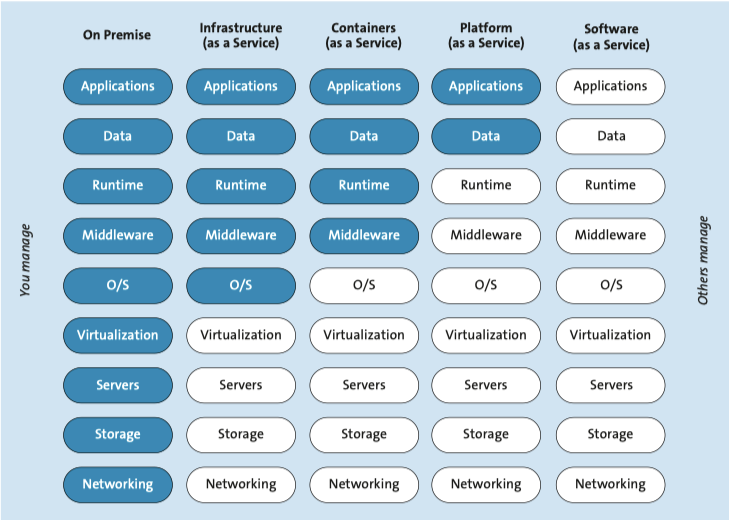

# Notizen zu "Skalierbare Container Infrastrukturen"

Einführung
=== 

Im Rahmen der Vertiefungsarbeit im HF Lehrgang IT Service Engineer, bin ich auf das Thema Docker gestossen. Zwar habe ich bereits kleinere Container zum Spass lokal auf meinem Rechner laufen lassen, allerdings weit bin ich zu diesem Zeitpunkt noch weit von jeglicher Konzeption oder übergreiffender Technologiekentnisse entfernt. 

In diesem Rahmen habe ich mich mit dem Thema auseinandergesetzt und den viel Zeit in eigenrecherche und dem bearbeiten von verschiedenen Lehrmitteln verbracht.

Worum gehts?
=== 

Der genaue Wortlaut der Aufgabenstellung in der Vertiefungsarbeit lautet folgdenermassen: 

>Definition von automatisch erstellbaren Arbeitsumgebungen der Studieren für >den Unterricht in Datenbank- und Web-Themen. Evaluation des Automatisierungskonzeptes, Definition der Umgebungen (Anfrage bei zuständigen Lehrpersonen), Realisierung und Test der Umgebung. 
>
>Zielsetzung: Die Arbeitsumgebung, die in den bestimmen Unterrichtsmodulen benötigt werden, sollen mit modernen IT-Automatisierungskonzepten auf den Laptops der Studierenden schnell und korrekt aufgesetzt werden können. Die Studierenden können diese Prozesse selbstständig konfigurieren und erweitern. 


Zusammengefasst: 

Eine automatisierte Anlage, welche fix fertige Umgebungen ausrollen kann um in den Modulen sofort arbeiten zu können und diese soll durch die Anwender noch angepasst und erweitert werden können.

Dabei soll das Automatisierungskonzept und die Technologie gewählt werden welche am besten für die Bedürfnisse der Lehrpersonen past.

Diverses
===

Gemäss Herrn Bernet - der hier mein Experte ist - soll ich mich mit verschiedenen Lehrmitteln um die Themen Microservices, CI/CD, DevOps, Kubernetes, Vagrant, Docker auseinandersetzen. 
Hierbei ist folgendes herausgekommen. 

Per Definition sind Microservices die kleinstmögliche Form von Service den man anbieten/erstellen kann. D.h dass folgerichtig pro Container - welcher beim heutigen Stand die effizienteste und kleinste Form der virtuallisierung darstellt - jeweils nur einen Service erbringen kann, und dessen Kombination schlussendich zum Ziel führt.


* Container pro Service
* Je simpler umso besser 

 > KISS - Keep it Simple and Stupid

 Dabei stellt sich unweigerlich die Frage welche Form von Dienst wir anbieten beziehungsweise welche Art von Inhalten wir verwalten müsssen um den Anforderungen gerecht zu werden. 

 Gemäss erster Abklärungen befinden sich in der TBZ bereits 5 Clustersysteme auf denen Kubernetes als Orchetrierungssoftware verwendet wird, was uns einen grossen Spielraum bietet. Ich kann also davon ausgehen, dass die Schule mir gegenüber "Infrastructure as a Servie" bietet, und ich hier ansetzen kann. 

   

Conitnuous Deliver / Continuous Integration / DevOps
=== 

### Continouos Integration (CI)

Semi-Automatisches Verfahren welches sich um Testing kümmert.
 
Beispiel:
------------
Entwickler schiebt Code auf Git, dort wird es mit zB make test geprüft und Fehler zurückgemeldet.
Wenn der Test erfogreich ist, wird der Code in die CD Pipeline weitergegeben wo sie weiter getestet wird.


### Continuous Delivery (CD)

"Weiterentwicklung" des CI. Nimmt weitere Test vor und deployt automatisiert auf zugelasssene Systeme.
lern in grossen Releases.

Beispiel anhand eines Softwareentwicklungszykluses

### Entwicklung
 Anstatt grosse Releases in grossen abständen zu machen und somit mehrere Baustellen gleichzeitige zu haben. werden einzelne Baustellen nach und nach in kleinen, automatisierten Releases gepatch.

### Qualitätssicherung
Wird anhand der CD automatisch in die Testumgebung ausgerollt und Code teilweise geterstet wenn es durch den CI gekommen ist.
Jede Änderung am Code wird automatisiert durch CI und CD geschoben und getestet (Post Build test).

### Auslieferung
Auslieferung in Testumgebung wird nach Abschluss der Test als neuen Build vollautomatisch ausgerollt.

Allgemein: Kurze Zyklen von Entwicklen und Testen erordern zwangsläufig die Automation.

Vorteile:
- Reproduzierbarkeit ist massiv verbessert
- Zurückrollen auf letzte Version vereinfacht


### Continuous Delivery Pipelines
Höhere Dichte an Builds, Tests und Deployments erfordern logischerweise a.) Automation b.) Neue Anforderungen an Hardware und VM0s. hierfür springen die Orchestriereungstools für Container ein welche sich in der Automatisierung einbinden lassen.


  # Vargant

Ähnlich wie Docker. Pullt VM-Image von Vargant Servern - https://app.vagrantup.com/boxes/search - aka als Box. Diese wird erst mit dem Vagrantfile welches im selben Ordner erstellt wird konfiguriert und mit "vagrant up" ausgeführt. Zuerst müssen aber die Änderungen mit "vagrant provision" aktuellisiert werden. 

Exposure, Volumes, Portweiterleitung im ähnlichen Rahmen wie Docker möglich. 

### Übersicht der Befehle 

| Befehl            | Beschreibung                                                                                                      |
| ----------------- | ----------------------------------------------------------------------------------------------------------------- |
| `vagrant init`    | Initialisiert im aktuellen Verzeichnis eine Vagrant-Umgebung und erstellt, falls nicht vorhanden, ein Vagrantfile |
| `vagrant up`      | Erzeugt und Konfiguriert eine neue Virtuelle Maschine, basierend auf dem Vagrantfile                              |
| `vagrant ssh`     | Baut eine SSH-Verbindung zur gewünschten VM auf                                                                   |
| `vagrant status`  | Zeigt den aktuellen Status der VM an                                                                              |
| `vagrant port`    | Zeigt die Weitergeleiteten Ports der VM an                                                                        |
| `vagrant halt`    | Stoppt die laufende Virtuelle Maschine                                                                            |
| `vagrant destroy` | Stoppt die Virtuelle Maschine und zerstört sie.                                                                   |

Weitere Befehle unter: https://www.vagrantup.com/docs/cli/


Anbindung an ESXI möglich. Benütigt weitere Plugins 

* https://www.vmware.com/support/developer/ovf/
* https://github.com/josenk/vagrant-vmware-esxi


## Packer

Packer ist ein Tool zur Erstellung von Images bzw. Boxen für eine Vielzahl von Dynamic Infrastructure Platforms mittels einer Konfigurationsdatei.

Anweisung in eine, Anweisungsfile "packer build", basierend auf JSON.

> https://www.w3schools.com/js/js_json_intro.asp


#### Provisioning

Auch bei Packer steht Provisioning für Anweisungen an ein anderes Programm (z.B. eine Shell wie Bash).

#### Builder
Die Builder erstellen ein Image für eine bestimmte dynamische Infrastruktur-Plattform (wie z.B. VirtualBox).

#### Post-processors
Sind Bestandteile von Packer, die das Ergebnis eines Builders oder eines anderen Post-Prozessor übernehmen, um damit ein neues Artefakt zu erstellen.

### Installation 
Erfolgt via Homebrew "brew install packer" oder als Paketdownload auf packer.io.

```Shell
    $ packer

    Usage: packer [--version] [--help] <command> [<args>]

    Available commands are:
        build       build image(s) from template
        fix         fixes templates from old versions of packer
        inspect     see components of a template
        validate    check that a template is valid
        version     Prints the Packer version
```


Repository für ablage von Boxen :  https://vagrantcloud.com/ 


Kann aber auch lokal abgelegt werden:     

```shell
Vagrant.configure(VAGRANTFILE_API_VERSION) do |config|
        config.vm.box = "ubuntu-server-amd64-virtualbox.box"
        config.vm.box_url = "http://localhost:8080/ubuntu-server-amd64-virtualbox.box"
    end
   ```
  
# [Nach Beispiel fragen]

# Docker

Standard-Test:
```Shell
    $ docker run hello-world
```

Startet einen Container mit einer interaktiven Shell (interactive, tty):
```Shell
    $ docker run -it ubuntu /bin/bash
```

Startet einen Container, der im Hintergrund (detach) läuft:
```Shell
    $ docker run -d ubuntu sleep 20
```

Startet einen Container im Hintergrund und löscht (remove) diesen nach Beendigung des Jobs:
```Shell
    $ docker run -d --rm ubuntu sleep 20
```

Startet einen Container im Hintergrund und legt eine Datei an:
```Shell
    $ docker run -d ubuntu touch /tmp/lock
```

Startet einen Container im Hintergrund und gibt das ROOT-Verzeichnis (/) nach STDOUT aus:
```Shell
    $ docker run -d ubuntu ls -l
```

**docker ps** <br>
* Gibt einen Überblick über die aktuellen Container, wie z.B. Namen, IDs und Status.

Aktive Container anzeigen:
```Shell
    $ docker ps
```

Aktive und beendete Container anzeigen (all):
```Shell
    $ docker ps -a
```

Nur IDs ausgeben (all, quit):
```Shell
    $ docker ps -a -q
```

**docker images** <br>
* Gibt eine Liste lokaler Images aus, wobei Informationen zu Repository-Namen, Tag-Namen und Grösse enthalten sind.

Lokale Images ausgeben:
```Shell
    $ docker images
```

Alternativ auch mit `... image ls`:
```Shell
    $ docker image ls
```

**docker rm und docker rmi** <br>
* `docker rm`
    *  Entfernt einen oder mehrere Container. Gibt die Namen oder IDs erfolgreich gelöschter Container zurück.
* `docker rmi`
    *  Löscht das oder die angegebenen Images. Diese werden durch ihre ID oder Repository- und Tag-Namen spezifiziert.

Docker Container löschen:
```Shell
    $ docker rm [name]
```

Alle beendeten Container löschen:
```Shell
    $ docker rm `docker ps -a -q`
```

Alle Container, auch aktive, löschen:
```Shell
    $ docker rm -f `docker ps -a -q`
```

Docker Image löschen:
```Shell
    $ docker rmi ubuntu
```

Zwischenimages löschen (haben keinen Namen):
```Shell
    $ docker rmi `docker images -q -f dangling=true`
```

**docker start** <br>
* Startet einen (oder mehrere) gestoppte Container. 
    * Kann genutzt werden, um einen Container neu zu starten, der beendet wurde, oder um einen Container zu starten, der mit `docker create` erzeugt, aber nie gestartet wurde.

Docker Container neu starten, die Daten bleiben erhalten:
```Shell
    $ docker start [id]
```

**Container stoppen, killen** <br>
* `docker stop`
    * Stoppt einen oder mehrere Container (ohne sie zu entfernen). Nach dem Aufruf von `docker stop` für einen Container wird er in den Status »exited« überführt.
* `docker kill`
    * Schickt ein Signal an den Hauptprozess (PID 1) in einem Container. Standardmässig wird SIGKILL gesendet, womit der Container sofort stoppt.

**Informationen zu Containern** <br>
* `docker logs`
    * Gibt die "Logs" für einen Container aus. Dabei handelt es sich einfach um alles, was innerhalb des Containers nach STDERR oder STDOUT geschrieben wurde.
* `docker inspect`
    * Gibt umfangreiche Informationen zu Containern oder Images aus. Dazu gehören die meisten Konfigurationsoptionen und Netzwerkeinstellungen sowie Volumes-Mappings.
* `docker diff`
    * Gibt die Änderungen am Dateisystem des Containers verglichen mit dem Image aus, aus dem er gestartet wurde.
* `docker top`
    * Gibt Informationen zu den laufenden Prozessen in einem angegebenen Container aus.


### Dockerfile
***
Ein Dockerfile ist eine Textdatei mit einer Reihe von Schritten, die genutzt werden können, um ein Docker-Image zu erzeugen.

Dazu wird zuerst ein Verzeichnis erstellt und darin eine Datei mit Namen "Dockerfile".

Anschliessend kann das Image wie folgt gebuildet werden:
```Shell
    $ docker build -t mysql .
```

Starten:
```Shell
    $ docker run --rm -d --name mysql mysql
```

Funktionsfähigkeit überprüfen:
```Shell
    $ docker exec -it mysql bash
```

Überprüfung im Container:
```Shell
    $ ps -ef
    $ netstat -tulpen
```

### Konzepte
***

**Build Context** <br>
* Der Befehl `docker build` erfordert ein Dockerfile und einen Build Context.
    * Der Build Context ist der Satz lokaler Dateien und Verzeichnisse, die aus ADD- oder COPY-Anweisungen im Dockerfile angesprochen werden können.
    * Er wird im Allgemeinen als Pfad zu einem Verzeichnis definiert.

**Layer / Imageschichten** <br>
* Jede Anweisung in einem Dockerfile führt zu einer neuen Imageschicht – einem Layer –, die wieder zum Starten eines neuen Containers genutzt werden kann.
* Die neue Schicht wird erzeugt, indem ein Container mit dem Image der vorherigen Schicht gestartet, dann die Dockerfile-Anweisung ausgeführt und schliesslich ein neues Image gespeichert wird.
* Ist eine Dockerfile-Anweisung erfolgreich abgeschlossen worden, wird der temporär erzeugte Container wieder gelöscht.

**Anweisungen im Dockerfile** <br>

* `FROM`
    * Welches Base Image von [hub.docker.com](https://hub.docker.com) verwendet werden soll, z.B. ubuntu:16.04
* `ADD`
    *  Kopiert Dateien aus dem Build Context oder von URLs in das Image.
* `CMD`
    * Führt die angegebene Anweisung aus, wenn der Container gestartet wurde. Ist auch ein ENTRYPOINT definiert, wird die Anweisung als Argument für ENTRYPOINT verwendet.
* `COPY`
    * Wird verwendet, um Dateien aus dem Build Context in das Image zu kopieren. Es gibt die zwei Formen COPY src dest und COPY ["src", "dest"]. Das JSON-Array-Format ist notwendig, wenn die Pfade Leerzeichen enthalten.
* `ENTRYPOINT`
    * Legt eine ausführbare Datei (und Standardargumente) fest, die beim Start des Containers laufen soll. 
    * Jegliche CMD-Anweisungen oder an `docker run` nach dem Imagenamen übergebenen Argumente werden als Parameter an das Executable durchgereicht. 
    * ENTRYPOINT-Anweisungen werden häufig genutzt, um "Start-Scripts" anzustossen, die Variablen und Services initialisieren, bevor andere übergebene Argumente ausgewertet werden.
* `ENV`
    * Setzt Umgebungsvariablen im Image.
* `EXPOSE`
    * Erklärt Docker, dass der Container einen Prozess enthält, der an dem oder den angegebenen Port(s) lauscht.
* `HEALTHCHECK`
    * Die Docker Engine prüft regelmässig den Status der Anwendung im Container.
        ```Shell 
            HEALTHCHECK --interval=5m --timeout=3s \ CMD curl -f http://localhost/ || exit 1`
        ```
* `MAINTAINER` 
    * Setzt die "Autor-Metadaten" des Image auf den angegebenen Wert.
* `RUN` 
    * Führt die angegebene Anweisung im Container aus und bestätigt das Ergebnis.
* `SHELL` 
    * Die Anweisung SHELL erlaubt es seit Docker 1.12, die Shell für den folgenden RUN-Befehl zu setzten. So ist es möglich, dass nun auch direkt bash, zsh oder Powershell-Befehle in einem Dockerfile genutzt werden können.
* `USER` 
    * Setzt den Benutzer (über Name oder UID), der in folgenden RUN-, CMD- oder ENTRYPOINT-Anweisungen genutzt werden soll.
* `VOLUME` 
    * Deklariert die angegebene Datei oder das Verzeichnis als Volume. Besteht die Datei oder das Verzeichnis schon im Image, wird sie bzw. es in das Volume kopiert, wenn der Container gestartet wird.
* `WORKDIR` 
    * Setzt das Arbeitsverzeichnis für alle folgenden RUN-, CMD-, ENTRYPOINT-, ADD oder COPY-Anweisungen.


# Netzwerk Anbindung

Stellen Sie sich vor, Sie lassen einen Webserver in einem Container laufen. Wie können Sie dann der Aussenwelt darauf Zugriff gewähren?

Die Antwort ist, Ports mit den Befehlen -p oder -P zu "veröffentlichen". Dieser Befehl leitet Ports auf den Host des Containers weiter.

**Beispiele** <br>

MySQL Container permanent an Host Port 3306 weiterleiten:
```Shell
    $ docker run --rm -d -p 3306:3306 mysql
```

MySQL Container mit nächsten freien Port verbinden:
```Shell
    $ docker run --rm -d -P mysql
```

**Erweiterung Dockerfile** <br>
Um Ports an den Host bzw. das Netzwerk weiterzuleiten, sind diese im Dockerfile via EXPOSE einzutragen.

Beispiel MySQL-Standardport:
```Shell
    EXPOSE 3306
```

**Zugriff vom Host erlauben** <br>
Um via Host auf den Container zuzugreifen sind ein paar Arbeiten zu erledigen.

Installation des MySQL Clients auf dem Host:
```Shell
    $ sudo apt-get install mysql-client
```

Freigabe des Ports in der MySQL-Config im Container, z.B. via Dockerfile:
```Shell
    RUN sed -i -e"s/^bind-address\s*=\s*127.0.0.1/bind-address = 0.0.0.0/" /etc/mysql/my.cnf
```

SQL Freigabe, via MySQL Client im Container einrichten:
```SQL
    CREATE USER 'root'@'%' IDENTIFIED BY 'admin';
    GRANT ALL PRIVILEGES ON *.* TO 'root'@'%';
    FLUSH PRIVILEGES;
```

Sind alle Arbeiten durchgeführt, sollte mit folgenden Befehl vom Host auf den MySQL Server, im Docker Container, zugegriffen werden können:
```Shell
    $ mysql -u root -p admin -h 127.0.0.1
```


### Container-Networking
***
Bei Docker können "Netzwerke" getrennt von Containern erstellt und verwaltet werden.

Wenn man Container startet, lassen sie sich einem bestehenden Netzwerk zuweisen, sodass sie sich direkt mit anderen Containern im gleichen Netzwerk austauschen können.

Standardmässig werden folgende Netzwerke eingerichtet:
* bridge 
    * Das Standard-Netzwerk indem gemappte Ports gegen aussen sichtbar sind.
* none
    * Für Container ohne Netzwerkschnittstelle bzw. ohne Netzanbindung.
* host
    * Fügt den Containern dem internen Host-Netzwerk hinzu, Ports sind nicht nach aussen sichtbar.

**Befehle** <br>

Auflisten der bestehenden Netzwerke:
```Shell
    $ docker network ls
```

Detailinformationen, inkl. der Laufenden Container zu einem Netzwerk:
```Shell
    $ docker network inspect bridge
```

Container erstellen ohne Netzwerkschnittstelle:
```Shell
    $ docker run --network=none -it --name c1 --rm busybox
    
    # Kontrollieren im Container 
    $ ifconfig  
```

Container erstellen mit dem Host-Netzwerk:
```Shell
    $ docker run --network=host -itd --name c1 --rm busybox
    
    # Kontrollieren mittels
    $ docker inspect host
```

Erstellen eines neuen Brigde-Netzwerk:
```Shell
    $ docker network create --driver bridge isolated_nw
```

Vorheriges MySQL- & Ubuntu-Beispiel starten und mit neuem Bridge-Netzwerk verbinden:
```Shell
    $ docker run --rm -d --network=isolated_nw --name mysql mysql
    $ docker run -it --rm --network=isolated_nw --name ubuntu ubuntu:14.04 bash
```

Im Ubuntu Container, Verbindung zum MySQL Server Port überprüfen:
```Shell
    $ sudo apt-get update && sudo apt-get install -y curl
    $ curl -f http://mysql:3306
```

**Container-Linking (veraltet)** <br>
Docker-Links sind die einfachste Möglichkeit, Container auf dem gleichen Host miteinander reden lassen zu können. Nutzt man das Standardnetzwerk-Modell von Docker, geschieht die Kommunikation zwischen Containern über ein internes Docker-Netzwerk, so dass sie nicht im Host-Netzwerk erreichbar sind.

Beispiel:
```Shell
    $ docker run -it --rm --link mysql:mysql ubuntu:14.04 bash
```

Innerhalb des MySQL-Containers:
```Shell
    env

    PATH=/usr/local/sbin:/usr/local/bin:/usr/sbin:/usr/bin:/sbin:/bin
    HOSTNAME=53a8e2acc32c
    MYSQL_PORT=tcp://172.17.0.2:3306
    MYSQL_PORT_3306_TCP=tcp://172.17.0.2:3306
    MYSQL_PORT_3306_TCP_ADDR=172.17.0.2
    MYSQL_PORT_3306_TCP_PORT=3306
    MYSQL_PORT_3306_TCP_PROTO=tcp
    MYSQL_NAME=/tender_feynman/mysql
    HOME=/root

    sudo apt-get update && sudo apt-get install -y curl mysql-client    
```

Testen ob der Port aktiv ist (auf Ubuntu):
```Shell
    $ curl -f http://${MYSQL_PORT_3306_TCP_ADDR}:${MYSQL_PORT_3306_TCP_PORT}
```

MySQL Client starten (auf Ubuntu):
```Shell
    $  mysql -u root -p admin -h ${MYSQL_PORT_3306_TCP_ADDR}
```


## Volumes
======

> [⇧ **Nach oben**](#inhaltsverzeichnis)

Bis jetzt gingen alle Änderungen im Dateisystem beim Löschen des Docker Containers komplett verloren.

Um Daten persistent zu halten, stellt Docker verschiedene Möglichkeiten zur Verfügung:
* Ablegen der Daten auf dem Host
* Sharen der Daten zwischen Container
* Eigene, sogenannte Volumes erstellen, zum Ablegen von Daten

**Erweiterung im Dockerfile** <br>
Um Daten auf dem Host oder in Volumes zu speichern, sind die Verzeichnis mit den Daten via `VOLUME` im Dockerfile einzutragen.

Beispiel MySQL:
```Shell
    VOLUME /var/lib/mysql
```


 Volumes
===
Volumes sind ein spezielles Verzeichnis auf dem Host in dem einer oder mehrere Container ihre Daten ablegen.

Volumes bieten mehrere nützliche Funktionen für persistente oder gemeinsam genutzte Daten:
* Volumes werden initialisiert, wenn ein Container erstellt wird.
* Wenn das Image des Containers, Daten am angegebenen Einhängepunkt enthält, werden die vorhandenen Daten nach der Volumeninitialisierung in das neue Volume kopiert.
* Volumes können gemeinsam genutzt und unter Containern wiederverwendet werden.
* Änderungen an einem "Data volumes" erfolgen direkt.
* Änderungen an einem "Data volumes" werden nicht berücksichtigt, wenn Sie ein Image aktualisieren.
* Volumes bleiben bestehen, auch wenn der Container selbst gelöscht wird.
* Volumes sind so ausgelegt, dass die Daten unabhängig vom Lebenszyklus des Containers bestehen bleiben.
* Docker löscht nie automatisch Volumes, wenn Sie einen Container entfernen, kann deshalb "Müll" übrigbleiben

**Beispiele** <br>
Busybox Container starten und neues Volume `/data` anlegen:
```Shell
    $ docker run --network=host -it --name c2 -v /data --rm busybox
    
    # Im Container
    $ cd /data
    $ mkdir t1
    $ echo "Test" >t1/test.txt
    
    # CTRL + P + CTRL + Q
    $ docker inspect c2
    
    # Nach Mounts suchen, z.B. 
            "Mounts": [
            {
                "Type": "volume",
                "Name": "ea99634523a0aa3d6fbf7ee02c491029170d7105f9c5404760a71e046ad55c67",
                "Source": "/var/lib/docker/volumes/ea99634523a0aa3d6fbf7ee02c491029170d7105f9c5404760a71e046ad55c67/_data",
                "Destination": "/data",
                "Driver": "local",
                "Mode": "",
                "RW": true,
                "Propagation": ""
            }
    
    # Datei ausgeben (auf Host)
    $ sudo cat /var/lib/docker/volumes/ea99634523a0aa3d6fbf7ee02c491029170d7105f9c5404760a71e046ad55c67/_data/t1/test.txt
```

Datenverzeichnis `/var/lib/mysql` vom Container auf dem Host einhängen (mount):
```Shell
    $ docker run -d -p 3306:3306  -v ~/data/mysql:/var/lib/mysql --name mysql --rm mysql
    
    # Datenverzeichnis
    $ ls -l ~/data/mysql
```

Einzelne Datei auf dem Host einhängen:
```Shell
    $ docker run --rm -it -v ~/.bash_history:/root/.bash_history ubuntu /bin/bash
```


 Datencontainer
===
Früher wurden Datencontainer erstellt, deren einziger Zweck das gemeinsame Nutzen von Daten durch andere Container war.

Dazu musste zuerst ein Container via `docker run` gestartet werden, damit andere via `--volumes-from` darauf zugreifen konnten.

Diese Methode war zwar funktionsfähig aber nicht ausbaufähig.
 
**Beispiel** <br>
Container mit Datencontainer `dbdata` erstellen:
```Shell
    $ docker create -v /dbdata --name dbstore busybox 
```

Zweiten Container erstellen, welcher auf den Datencontainer `dbdata` zugreift:
```Shell
    $  docker run -it --volumes-from dbstore --name db busybox
    
    # Im Container
    $ ls -l /dbdata
```

Der Datencontainer `dbdata` ist nun unter dem root-Verzeichnis als `/dbdata` eingehängt.


Named Volumes
===
Seit der Version 1.9 von Docker existiert das Kommando `docker volume` zur Verwaltung von Volumes auf einem Docker Host:
* Man kann damit verschiedene Volume-Driver-Dateisysteme für Container bereitstellen.
* Ein Volume kann nun auf einem Host angelegt werden und dem verschiedenen Container bereitgestellt werden.
* Volumes können einheitlich mit diesen Befehlen verwaltet werden.
* Wenn keine Default-Dateien auf dem Volume benötigt werden, kann auf einen separaten Datencontainer verzichtet werden.
* Mit diesem Schritt können nun verschiedene Dateisysteme und Optionen effizient in Containern genutzt werden.

**Beispiele** <br>
Erstelle eine Volume `mysql`:
```Shell
    $ docker volume create mysql
```

Ausgabe aller vorhandenen Volumes:
```Shell
    $ docker volume ls
```

Erstellt einen Container `c2` und hängt das Volume unter `/var/lib/mysql` ein:
```Shell
    $ docker run  -it --name c2 -v mysql:/var/lib/mysql --rm busybox
```

Die Abhängigkeit Volume Verzeichnis kann auch im Dockerfile hinterlegt werden:
```Shell
    VOLUME mysql:/var/lib/mysql
```

Weitere Befehle
===

* "-D" für den Debug-Modus
* "-H" für die Konfiguration des tcp Ports
* "-tls" um TLS zu aktivieren bzw. zu deaktivieren


Architektur
=== 

Die Architektur der Docker Engine
Wir haben bereits die Begriffe des Images, der Container, der Command Line und des Daemons benutzt; bevor wir weitermachen, schauen wir uns nun an, wie die Docker Engine aufgebaut ist, um die Architektur und Terminologie zu verstehen. Docker besteht aus zwei zentralen Bestandteilen, nämlich:

dem HTTP-Server, der in der Praxis das Backend bildet, das ein REST API zur Integration von Anwendungen in die Engine zur Verfügung stellt und
dem Docker CLI, einem Command Line Tool, das das API verwendet, um alle Funktionen leicht benutzbar zu machen.

<br>
   

Sicherheit
===

## Grundsätzlich wichtige Ansätze
* Quelle des Image sollte vertrauenwürdig sein

* Software in Images sollte aktuell sein, damit nicht bekannte Lücken genutzt werden können


## Least Privilege 

Der Container sollte möglichst wenig und mit möglichst eingeschränkten Rechten arbeiten können. Um dies zu erreichen kann man folgende Massnahmen treffen:

* ... Sicherstellen, dass Prozesse in Containern nicht als root laufen, sodass das Ausnutzen von Sicherheitslücken in einem Prozess, dem Angreifer keine root-Berechtigungen geben.

* ... Dateisysteme schreibgeschützt einsetzen, sodass Angreifer keine Daten überschreiben oder böswillige Skripten speichern können.

* ... Kernel-Aufrufe, die ein Container ausführen kann, einschränken, um die Angriffsoberfläche zu verringern.

* ... Ressourcen begrenzen, die ein Container nutzen kann, um DoS-Angriffe zu verhindern, bei denen ein kompromittierter Container oder eine Anwendung so viele Ressourcen aufbraucht (wie z.B. Speicher oder CPU-Zeit), sodass der Host zum Halten kommt.

## Weitere Sicherhehitsmassnahmen


* Die Container laufen in einer VM oder auf einem dedizierten Host, um zu vermeiden, dass andere Benutzer oder Services angegriffen werden können.
* Der Load Balancer / Reverse-Proxy ist der einzige Container, der einen Port nach aussen freigibt, wodurch viel Angriffsfläche verschwindet. Monitoring oder Logging-Services sollten über private Schnittstellen oder VPN nutzbar sein.
* Alle Images definieren einen Benutzer und laufen nicht als root.
* Alle Images werden über den eigenen Hash heruntergeladen oder auf anderem Wege sicher erhalten und verifiziert.
* Die Anwendung wird überwacht und es wird Alarm ausgelöst, wenn eine ungewöhnliche Netzwerklast oder auffällige Zugriffsmuster erkannt werden.
* Alle Container laufen mit aktueller Software und im Produktivmodus – Debug-Informationen sind abgeschaltet.
* AppArmor oder SELinux sind auf dem Host aktiviert
* Services wie z.B. Apache, Mysql ist mir irgendeiner Form der Zugriffskontrolle oder einem Passwortschutz ausgestattet.
* Unnötige setuid-Binaries werden aus den identidock-Images entfernt. Damit verringert sich das Risiko, dass Angreifer, die Zugriff auf einen Container erhalten haben, ihre Berechtigungen erweitern können.
* Dateisysteme werden so weit wie möglich schreibgeschützt eingesetzt.
* Nicht benötigte Kernel-Berechtigungen werden so weit wie möglich entfernt.

Besonders gefärdete Container sollten zusätzlich folgenden Massnahmen unterzogen werden: 

* Der Speicher für jeden Container wird durch das Flag -m begrenzt. Damit werden ein paar DoS-Angriffe und Speicherlecks eingedämmt. Die Container müssen dabei entweder per Profiler analysiert werden oder man gibt sehr grosszügige Speichergrenzen vor.
* SELinux mit speziellen Typen für die Container ausführen. Das kann eine sehr effektive Sicherheitsmassnahme sein, aber sie erfordert einiges an Arbeit.
* Ein ulimit auf die Anzahl der Prozesse anwenden. Diese Grenze ist für den Benutzer des Containers gültig, daher kann es schwieriger einzusetzen sein, als man denkt. So vermeidet man die Gefahr von Fork-Bomben, die als DoSAngriff eingesetzt werden.
* Interne Kommunikation wird verschlüsselt, so dass es für Angreifer schwieriger wird, die Daten zu beeinflussen.